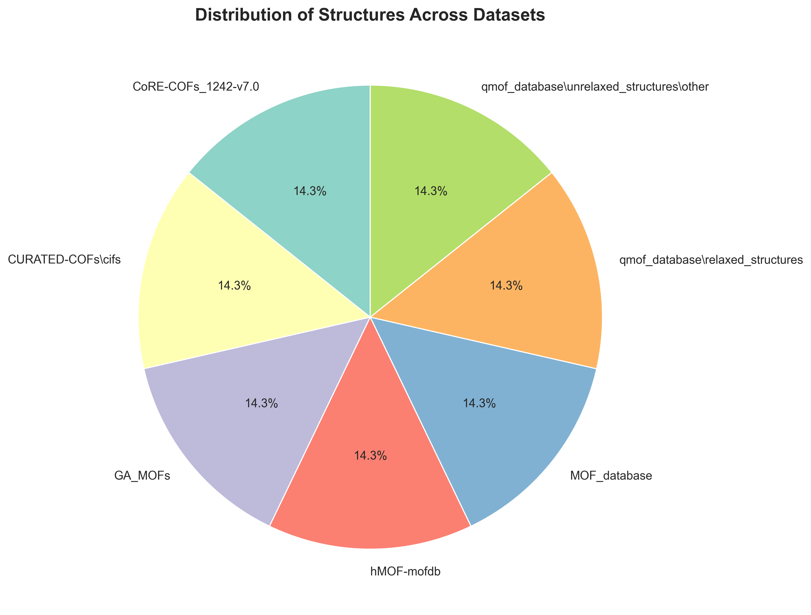
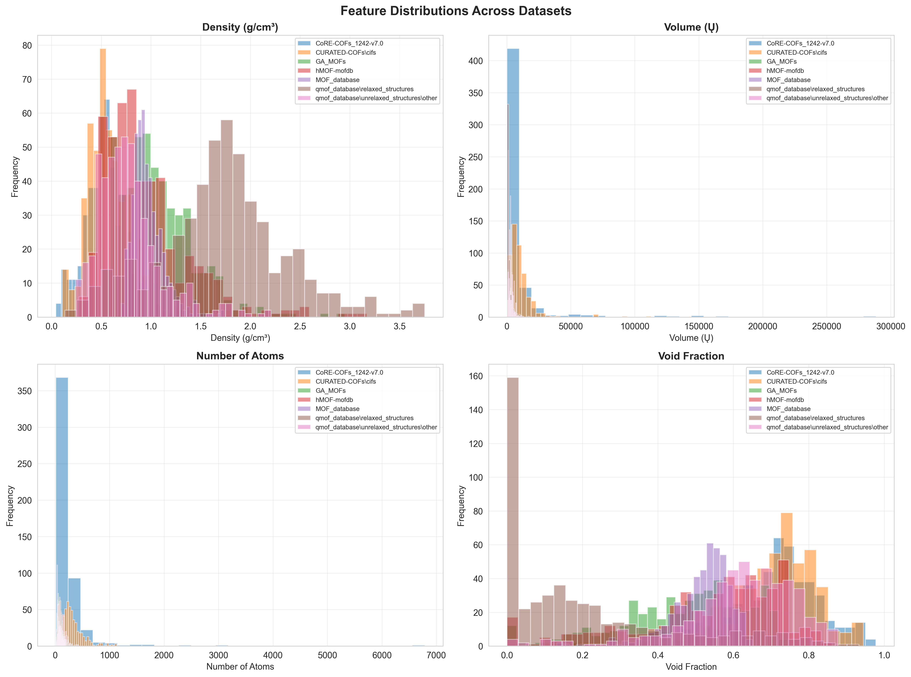
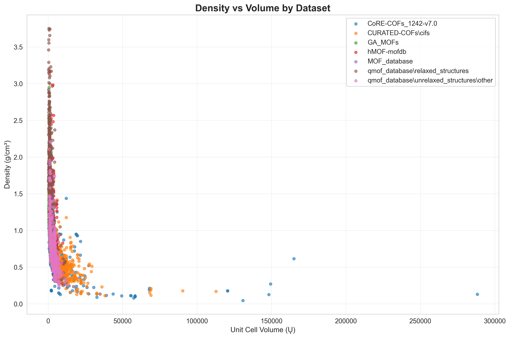
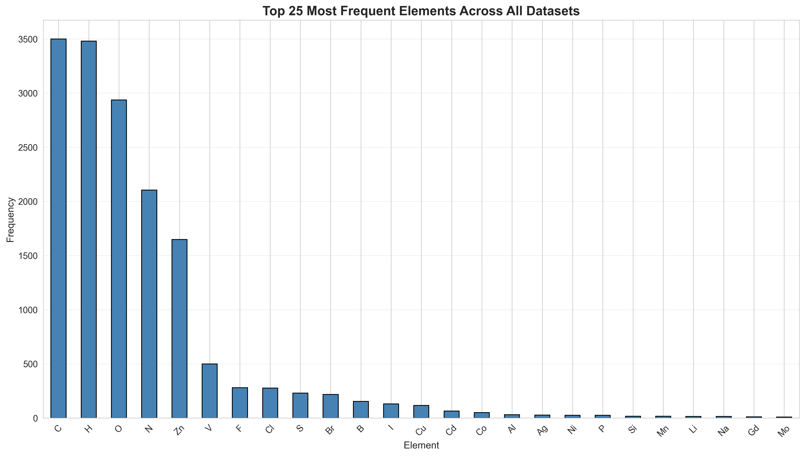
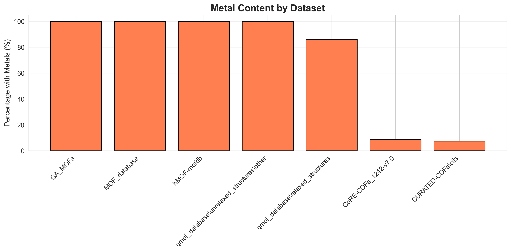

# Complete MOF/COF Database - Exploratory Data Analysis

## Executive Summary

- **Total Structures Analyzed**: 3,500
- **Number of Datasets**: 7
- **Unique Elements**: 62
- **Structures with Metals**: 2,510 (71.7%)

## Dataset Breakdown

### CoRE-COFs_1242-v7.0

- **Count**: 500 structures
- **Avg Atoms**: 242.9
- **Avg Density**: 0.589 g/cm³
- **Avg Volume**: 8969.9 Ų
- **Metal Content**: 8.6%

### CURATED-COFs\cifs

- **Count**: 500 structures
- **Avg Atoms**: 325.8
- **Avg Density**: 0.596 g/cm³
- **Avg Volume**: 10057.8 Ų
- **Metal Content**: 7.4%

### GA_MOFs

- **Count**: 500 structures
- **Avg Atoms**: 68.1
- **Avg Density**: 1.065 g/cm³
- **Avg Volume**: 1435.7 Ų
- **Metal Content**: 100.0%

### hMOF-mofdb

- **Count**: 500 structures
- **Avg Atoms**: 124.3
- **Avg Density**: 0.944 g/cm³
- **Avg Volume**: 3148.9 Ų
- **Metal Content**: 100.0%

### MOF_database

- **Count**: 500 structures
- **Avg Atoms**: 75.7
- **Avg Density**: 0.975 g/cm³
- **Avg Volume**: 2063.2 Ų
- **Metal Content**: 100.0%

### qmof_database\relaxed_structures

- **Count**: 500 structures
- **Avg Atoms**: 106.9
- **Avg Density**: 1.725 g/cm³
- **Avg Volume**: 1762.8 Ų
- **Metal Content**: 86.0%

### qmof_database\unrelaxed_structures\other

- **Count**: 500 structures
- **Avg Atoms**: 102.2
- **Avg Density**: 0.773 g/cm³
- **Avg Volume**: 3416.8 Ų
- **Metal Content**: 100.0%

## Overall Statistics

**Density (g/cm³)**:
- Range: 0.045 - 3.753
- Mean ± Std: 0.952 ± 0.521

**Unit Cell Volume (Ų)**:
- Range: 152.3 - 288235.2
- Mean ± Std: 4407.9 ± 9540.2

**Number of Atoms**:
- Range: 15 - 6784
- Mean ± Std: 149.4 ± 191.0

## Element Distribution

**Top 20 Most Common Elements**:

- C: 3,500 occurrences
- H: 3,480 occurrences
- O: 2,936 occurrences
- N: 2,105 occurrences
- Zn: 1,648 occurrences
- V: 498 occurrences
- F: 279 occurrences
- Cl: 275 occurrences
- S: 229 occurrences
- Br: 217 occurrences
- B: 152 occurrences
- I: 130 occurrences
- Cu: 116 occurrences
- Cd: 63 occurrences
- Co: 49 occurrences
- Al: 29 occurrences
- Ag: 26 occurrences
- Ni: 24 occurrences
- P: 24 occurrences
- Si: 16 occurrences

## Visualizations

### Dataset Distribution

### Feature Distributions by Dataset

### Density vs Volume

### Element Frequency

### Metal Content Comparison

## Key Findings & Recommendations

1. **Dataset Diversity**: The database contains diverse MOF/COF structures across multiple datasets
2. **Metal Content**: Majority of structures contain metal centers, typical for MOFs
3. **Property Range**: Wide range in density, volume, and atom counts indicates structural diversity
4. **Next Steps**:
   - Perform clustering analysis to identify structure families
   - Calculate additional geometric descriptors (pore size, surface area)
   - Integrate with property databases for supervised learning
   - Consider molecular simulation for property prediction

---

*Report generated: 2026-04-03 12:34:00*
